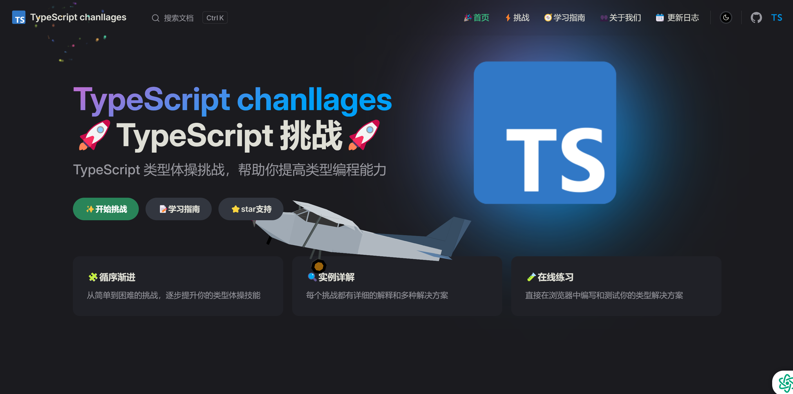

# 🚀 TypeScript Gymnastics Challenge

[](https://github.com/ExploitationExplorers/typecript-gymnastics-challenge/stargazers)
[](https://github.com/ExploitationExplorers/typecript-gymnastics-challenge/blob/master/LICENSE)
[](https://github.com/ExploitationExplorers/typecript-gymnastics-challenge/graphs/contributors)

✨ 欢迎来到TypeScript类型体操训练场！本项目通过一系列精心设计的挑战题目，帮助你掌握TypeScript高级类型编程技巧。

🌐 在线体验地址：https://typecript-gymnastics-challenge.vercel.app

## 🧩 项目首页



## 🎯 项目特点
- 🧩 渐进式难度设计，从基础到进阶
- 🔬 每个挑战都配备单元测试
- 🛠️ 基于Vitest的测试环境
- 📈 实时类型验证反馈
- 🏆 成就系统激励学习
- 
## 📚 挑战题目
### 🐣 简单难度（Easy）
- `Capitalize` 🆙 - 字符串首字母大写
- `TupleToObject` 🏷️ - 元组转对象类型
- `FirstOfArray` 🥇 - 获取数组第一个元素类型
- `LengthOfTuple` 📏 - 获取元组长度类型
.....
### 🦊 中等难度（Medium） 
- `Exclude` 🚫 - 实现类型排除运算
- `Awaited` ⏳ - 递归解包Promise类型
- `If<C, T, F>` 🤔 - 类型条件判断
- `Concat<T, U>` ➕ - 类型安全的数组合并
.....
### 🐉 困难难度（Hard）
- `Curry` 🍛 - 函数柯里化类型
- `StringToNumber` 🔢 - 字符串转数字类型
- `UnionToIntersection` ⚡ - 联合类型转交叉类型
- `DeepReadonly` 🔒 - 深度只读类型转换
- `Permutation` 🌀 - 生成所有可能的类型排列

....

## 🧑💻 快速开始
```bash
# 克隆项目
git clone https://github.com/ExploitationExplorers/typecript-gymnastics-challenge.git

# 安装依赖
npm install

# 运行测试
npm run docs:dev
```

## 🤝 参与贡献
欢迎提交PR！请参考：

1. 在 src/challenges/ 目录创建新挑战
2. 更新 docs/ 中的文档说明


## 📄 许可证
MIT License © 2024 ExploitationExplorers